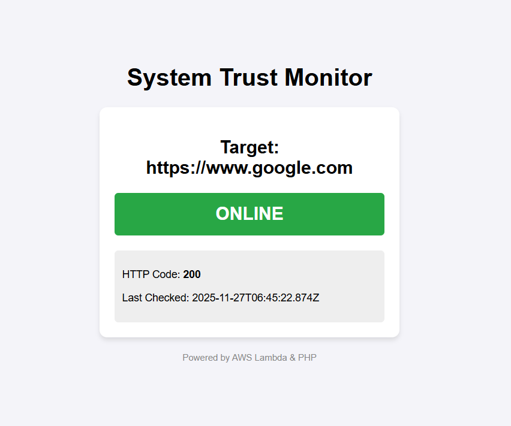

# Serverless Trust Monitor (AWS Lambda + PHP)

## Project Overview
This project is a Full-Stack health monitoring system designed to track the uptime of external websites. It replicates the architecture of an **Online Trust Monitor**, ensuring reliability and real-time status updates.

It demonstrates the integration between a **Serverless Backend (AWS Lambda)** and a **Traditional Web Frontend (PHP)**, using secure HTTP requests (cURL) to fetch and display data.

## 🏗 Architecture
**Logic Flow:**
`Target URL` -> `AWS Lambda (Node.js)` -> `Function URL (JSON)` -> `PHP Backend (cURL)` -> `HTML/CSS Dashboard`

* **Backend:** AWS Lambda (Node.js 20.x) performing HTTP health checks.
* **API Layer:** AWS Lambda Function URL (Public Endpoint).
* **Frontend:** PHP 8.x using cURL for API consumption.
* **Styling:** Custom CSS for status visualization.

## 🛠 Tech Stack
* **Cloud:** AWS Lambda, Serverless Architecture
* **Languages:** Node.js (Backend), PHP (Integration), HTML/CSS (UI)
* **Development Environment:** Visual Studio Code (VS Code)
* **Data Format:** JSON

## 📸 Screenshots
### The Dashboard

*Real-time status display showing HTTP 200 OK response.*

## 🚀 How to Run Locally

### Prerequisites
* PHP 8.x installed via XAMPP or manually.
* VS Code.

### Installation Steps
1.  Clone the repository.
2.  Navigate to the `frontend` directory.
3.  Start the local PHP server:
    ```bash
    php -S localhost:8000
    ```
4.  Open `http://localhost:8000` in your browser.

### 🔧 Configuration & Troubleshooting
**Note on Local PHP Environment:**
During development, I configured the local `php.ini` environment to support secure API calls:
* Initialized `php.ini` from default.
* Enabled `extension=curl` to handle remote API requests securely.
* Configured `openssl` for HTTPS handshake verification.

## 📄 Code Structure
* `/lambda/index.mjs`: The serverless logic that pings the target URL and returns a JSON object.
* `/frontend/index.php`: The display logic that consumes the API and renders the UI.